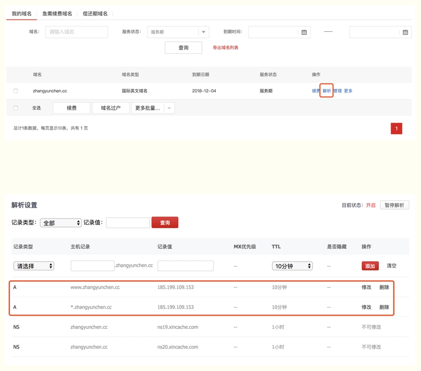

##这是个首页
有阅读障碍的同学，可以跳过第一至四节，下载我写好的工具包: 
git clone https://github.com/zhangyunchencc/vuepress-devkit.git 
然后从第五节开始看。

## 一、为什么你需要一个博客？
优秀的程序员都在写博客，写博客有很多好处：

帮助自己梳理、总结、理解知识点（个人提升）
帮助别人理解知识点（好人一生平安）
简历更好看，更多面试机会（升职加薪）
## 二、什么是 VuePress，为什么要使用 VuePress ？
VuePress 是尤雨溪（vue.js 框架作者）4月12日发布的一个全新的基于 vue 的静态网站生成器，实际上就是一个 vue 的 spa 应用，内置 webpack，可以用来写文档。详见 VuePress中文网
其实类似的建站工具有很多，比如 WordPress、Jekyll、Hexo 等，其中 WordPress 需要自己购买虚拟主机，不考虑；Jekyll 是 Github-Page 默认支持的，听说操作比较复杂，没有用过不做过多评价了；Hexo 之前一直在用，但一直觉得主题不好看，风格不够简洁优雅。自从遇见 VuePress，嗯，就是它了~
VuePress 有很多优点：
界面简洁优雅（个人感觉比 HEXO 好看）
容易上手（半小时能搭好整个项目）
更好的兼容、扩展 Markdown 语法
响应式布局，PC端、手机端
Google Analytics 集成
支持 PWA

## 三、开始搭建
创建项目文件夹
可以右键手动新建，也可以使用 mkdir 命令新建：
```
mkdir vuepressBlogDemo
```
全局安装 VuePress
```
npm install -g vuepress
```
进入 vuepressBlogDemo 文件夹，初始化项目
使用 npm init 或 npm init -y（默认yes）
```
npm init -y
```
创建文件夹和文件
在 vuepressBlogDemo 文件夹中创建 docs 文件夹，在 docs 中创建 .vuepress 文件夹，在.vuepress中创建 public 文件夹和 config.js 文件，最终项目结构如下所示：
```
vuepressBlogDemo
├─── docs
│   ├── README.md
│   └── .vuepress
│       ├── public
│       └── config.js
└── package.json
在 config.js 文件中配置网站标题、描述、主题等信息
module.exports = {
  title: 'Chen\'s blog',
  description: '我的个人网站',
  head: [ // 注入到当前页面的 HTML <head> 中的标签
    ['link', { rel: 'icon', href: '/logo.jpg' }], // 增加一个自定义的 favicon(网页标签的图标)
  ],
  base: '/', // 这是部署到github相关的配置
  markdown: {
    lineNumbers: false // 代码块显示行号
  },
  themeConfig: {
    nav:[ // 导航栏配置
      {text: '前端基础', link: '/accumulate/' },
      {text: '算法题库', link: '/algorithm/'},
      {text: '微博', link: 'https://baidu.com'}      
    ],
    sidebar: 'auto', // 侧边栏配置
    sidebarDepth: 2, // 侧边栏显示2级
  }
};
```
在 package.json 文件里添加两个启动命令
```
"scripts": {
  "dev": "vuepress dev docs",
  "build": "vuepress build docs"
}
```
一切就绪 跑起来看看吧
```
npm run dev
```
## 四、一些小亮点
完成了基础搭建后，就可以在docs目录下新建 .md 文件写文章了（.md 是 Markdown 语法文件，你需要知道 Markdown 的一些基本写法，很简单，这里给大家一份 Markdown 语法整理大集合）

下面给大家安利一些实用的方法。

代码块高亮
在 .md 文件中书写代码时，可在 ``` 后增加 js、html、json等格式类型，代码块即可按照指定类型高亮

自定义容器
代码：
```
::: tip 提示
this is a tip
:::

::: warning 注意
this is a tip
:::

::: danger 警告
this is a tip
:::
```
支持Emoji
代码：

:tada: :100: :bamboo: :gift_heart: :fire:

支持 PWA
VuePress 默认支持 PWA，配置方法如下：

config.js 文件中增加
```
head: [ // 注入到当前页面的 HTML <head> 中的标签
  ['link', { rel: 'manifest', href: '/photo.jpg' }],
  ['link', { rel: 'apple-touch-icon', href: '/photo.jpg' }],
],
serviceWorker: true // 是否开启 PWA
```
public 文件夹下新建 manifest.json 文件，添加
```
{
  "name": "张三",
  "short_name": "张三",
  "start_url": "index.html",
  "display": "standalone",
  "background_color": "#2196f3",
  "description": "张三的个人主页",
  "theme_color": "blue",
  "icons": [
    {
      "src": "./photo.jpg",
      "sizes": "144x144",
      "type": "image/png"
    }
  ],
  "related_applications": [
    {
      "platform": "web"
    },
    {
      "platform": "play",
      "url": "https://play.google.com/store/apps/details?id=cheeaun.hackerweb"
    }
  ]
}
```

最后在 iPhone 的 safrai 浏览器中打开本网站，点击 +添加到主屏幕 就能在桌面看到一个像原生 App 一样的图标（感觉自己写了一个 App 有木有 smile）

##五、部署上线
说了这么多都是在本地进行的，现在我们要把本地的内容推送到某个服务器上，这样只要有网络，就可以随时随地看自己的网站了。

一般来说，有两种方案可供选择：

自己买一个服务器，阿里云、腾讯云等，这种方式的好处是速度有保证、可以被搜索引擎收录，坏处是要花钱啊 moneybag 土豪同学可以考虑。
使用 Github Pages 。什么是 Github Pages 呢？简单说就是 Github 提供的、用于搭建个人网站的静态站点托管服务。很多人用它搭建个人博客。这种方式的好处是免费、方便，坏处是速度可能会有些慢、不能被国内的搜索引擎收录。
最终我选择了方案2，下面将给大家讲解如何使用 Github Pages 服务。

登陆 Github
打开 github 网站，登陆自己的 github 账号（没有账号的快去注册并面壁思过作为一个优秀的程序员为啥连一个github账号都没有）

接着我们新建两个仓库，

新建仓库一： USERNAME.github.io （不用克隆到本地）
注意！
USERNAME 必须是你 Github 的账号名称，不是你的名字拼音，也不是你的非主流网名，不要瞎起，要保证和Github账号名一模一样！
例如我的 Github 账号名称是 helloworldtang


 

那么新建仓库，Repository name 就填写为：helloworldtang.github.io


这个仓库建好后，不用克隆到本地，内容更新修改都在下面的仓库中进行。

新建仓库二：随便起一个名字，比如：vuepressBlog （克隆到本地）
这个项目是用来开发博客的，以后只需要改这个项目就够了。

使用工具包的，将 vuepress-devkit 中的内容拷贝到 vuepressBlog 文件夹中
自己从头搭建的，将 vuepressBlogDemo 文件夹的内容拷贝到仓库二，并在根目录下创建 deploy.sh 文件，内容如下：
```
#!/usr/bin/env sh

# 确保脚本抛出遇到的错误
set -e

# 生成静态文件
npm run build

# 进入生成的文件夹
cd docs/.vuepress/dist

# 如果是发布到自定义域名
# echo 'www.yourwebsite.com' > CNAME

git init
git add -A
git commit -m 'deploy'

# 如果你想要部署到 https://USERNAME.github.io
git push -f git@github.com:USERNAME/USERNAME.github.io.git master

# 如果发布到 https://USERNAME.github.io/<REPO>  REPO=github上的项目

# git push -f git@github.com:USERNAME/<REPO>.git master:gh-pages

cd -

修改仓库二中的 deploy.sh 发布脚本
把文件中的 USERNAME 改成 Github 账号名，例如我的账号名是 zhangyunchencc，那么就可以改为：
```

#### 如果你想要部署到 https://USERNAME.github.io
```
git push -f git@github.com:zhangyunchencc/zhangyunchencc.github.io.git master
```
这样仓库二和仓库一就建立了关联。

简单说二者的关系是：仓库一负责显示网站内容，我们不需要改动它；日常开发和新增内容，都在仓库二中，并通过 npm run deploy 命令，将代码发布到仓库一。

在 package.json 文件夹中添加发布命令（使用工具包的请忽略）
```
"scripts": {
  "deploy": "bash deploy.sh"
}
```
大功告成，运行发布命令
```
npm run deploy
```
此时打开 Github Settings 中下面的链接: https://zhangyunchencc.github.io/ 即可看到自己的主页啦~


## 六、发布到自己的个人域名
如果你不满足于 https://zhangyunchencc.github... 这样的域名，想要一个自己个人的专属域名，比如 http://www.zhangyunchen.cc/ ，毕竟一些大牛（阮一峰 http://www.ruanyifeng.com/blog/） 都是自己名字的网址哦，很方便很酷呢 😎

下面跟着步骤一步步来就好啦~

购买域名
推荐在 新网 或 万网 购买

我是在新网购买的，下面以新网为例，万网是类似的。

购买完成后进入管理后台，点击 ”解析“ 按钮，添加下面两条内容：


 

 

 


 

 

 

注意这里有坑！！！在 万网 购买域名的同学请注意，第二条记录中的 请用 @ 代替，万网不支持

记录值里的 IP 可以通过 ping 自己的域名得到：
```
ping www.username.github.io
```
添加 CNAME 文件
在仓库一 USERNAME.github.io 中找到 Settings > Custom domain 把 www.zhangyunchen.cc 添加进去即可。

大功告成，打开 https://www.zhangyunchen.cc 看一下吧~~~
七、最后
你需要一些 Markdown 语法的基础知识；
你需要一个 Github 账号，并在里面创建两个 repo
Github 需要添加 ssh key，遇到问题可以百度解决；
个人博客不只可以用来写技术相关的内容，也可以有自己写的文章、随笔，甚至上传一些照片。
以上